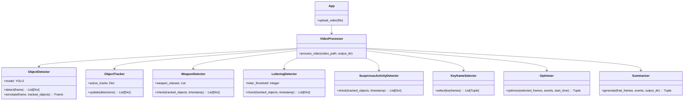

# Class Diagram

```mermaid
classDiagram
    class App {
        +upload_video(file)
    }
    class VideoProcessor {
        +process_video(video_path, output_dir)
    }
    class ObjectDetector {
        +model: YOLO
        +detect(frame): List[Dict]
        +annotate(frame, tracked_objects): Frame
    }
    class ObjectTracker {
        +active_tracks: Dict
        +update(detections): List[Dict]
    }
    class WeaponDetector {
        +weapon_classes: List
        +check(tracked_objects, timestamp): List[Dict]
    }
    class LoiteringDetector {
        +loiter_threshold: Integer
        +check(tracked_objects, timestamp): List[Dict]
    }
    class SuspiciousActivityDetector {
        +check(tracked_objects, timestamp): List[Dict]
    }
    class KeyframeSelector {
        +select(keyframes): List[Tuple]
    }
    class Optimizer {
        +optimize(selected_frames, events, start_time): Tuple
    }
    class Summarizer {
        +generate(final_frames, events, output_dir): Tuple
    }

    App --> VideoProcessor
    VideoProcessor --> ObjectDetector
    VideoProcessor --> ObjectTracker
    VideoProcessor --> WeaponDetector
    VideoProcessor --> LoiteringDetector
    VideoProcessor --> SuspiciousActivityDetector
    VideoProcessor --> KeyframeSelector
    VideoProcessor --> Optimizer
    VideoProcessor --> Summarizer
```
