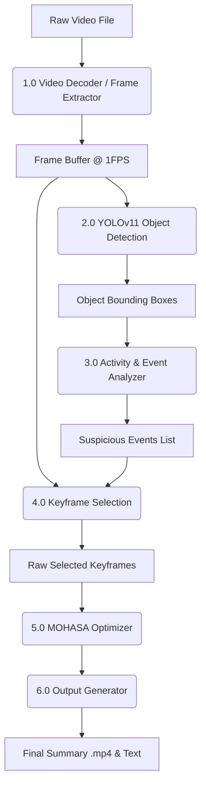

# DFD Level 1

```mermaid
graph TD
    A[Raw Video File] --> P1(1.0 Video Decoder / Frame Extractor)
    P1 --> F1[Frame Buffer @ 1FPS]
    F1 --> P2(2.0 YOLOv11 Object Detection)
    P2 --> F2[Object Bounding Boxes]
    F2 --> P3(3.0 Activity & Event Analyzer)
    P3 --> F3[Suspicious Events List]
    F1 --> P4(4.0 Keyframe Selection)
    F3 --> P4
    P4 --> F4[Raw Selected Keyframes]
    F4 --> P5(5.0 MOHASA Optimizer)
    P5 --> P6(6.0 Output Generator)
    P6 --> F5[Final Summary .mp4 & Text]
```
