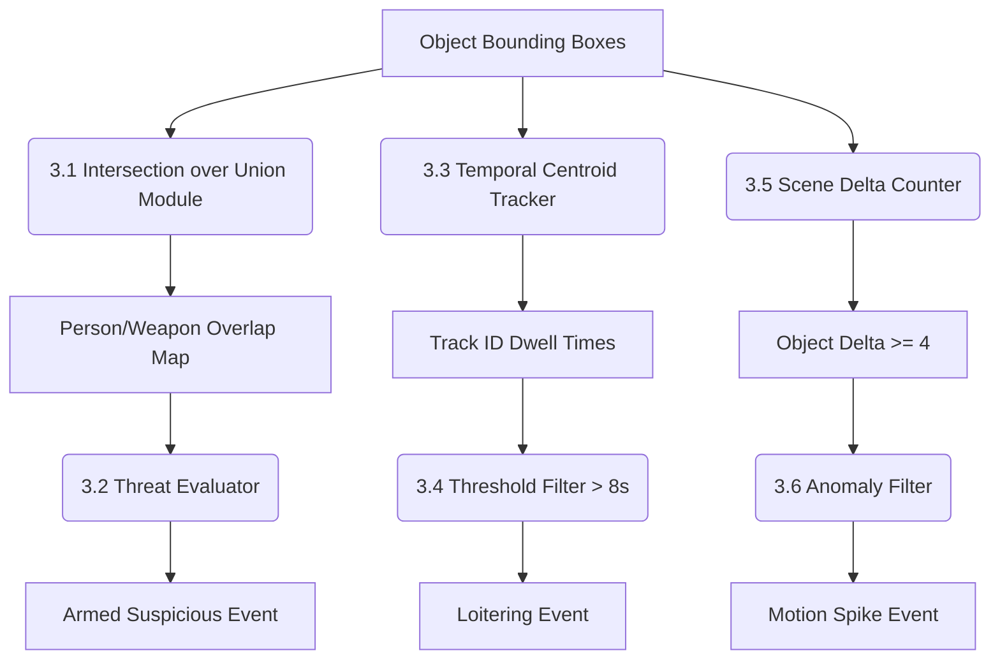

# DFD Level 2 (Suspicious Event Analyzer Sub-processes)

```mermaid
graph TD
    A[Object Bounding Boxes] --> P3_1(3.1 Intersection over Union Module)
    P3_1 --> F3_1[Person/Weapon Overlap Map]
    F3_1 --> P3_2(3.2 Threat Evaluator)
    P3_2 --> E1[Armed Suspicious Event]
    
    A --> P3_3(3.3 Temporal Centroid Tracker)
    P3_3 --> F3_2[Track ID Dwell Times]
    F3_2 --> P3_4(3.4 Threshold Filter > 8s)
    P3_4 --> E2[Loitering Event]
    
    A --> P3_5(3.5 Scene Delta Counter)
    P3_5 --> F3_3[Object Delta >= 4]
    F3_3 --> P3_6(3.6 Anomaly Filter)
    P3_6 --> E3[Motion Spike Event]
```
