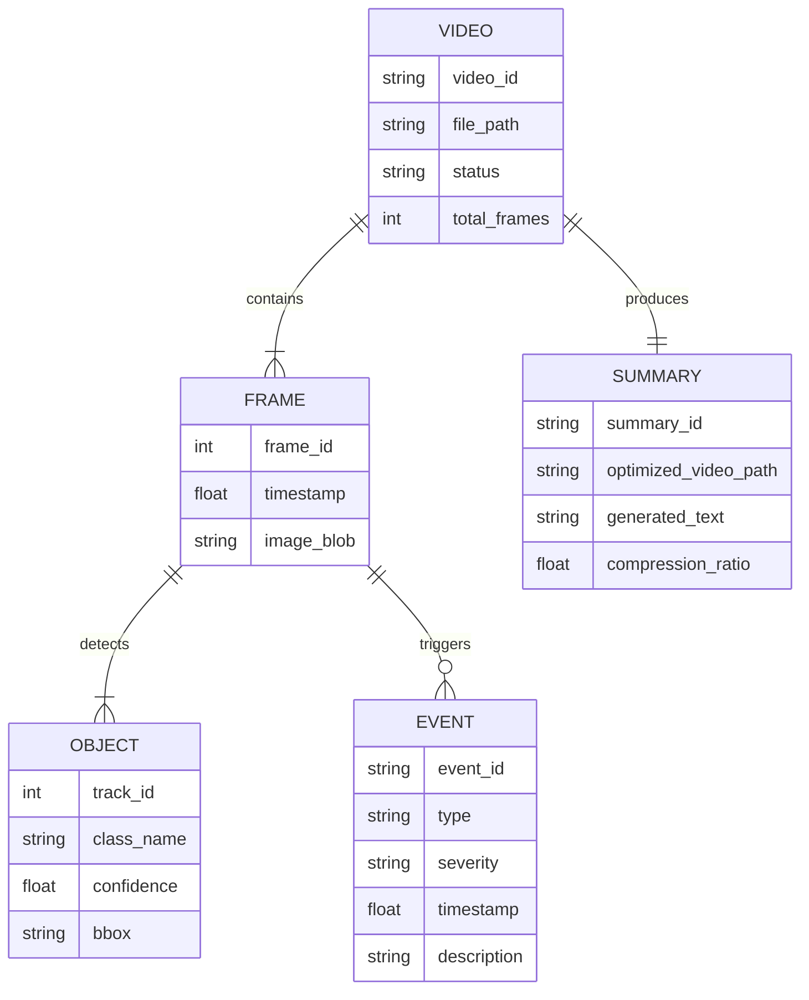

# Entity Relationship Diagram

```mermaid
erDiagram
    VIDEO {
        string video_id
        string file_path
        string status
        int total_frames
    }
    FRAME {
        int frame_id
        float timestamp
        string image_blob
    }
    OBJECT {
        int track_id
        string class_name
        float confidence
        string bbox
    }
    EVENT {
        string event_id
        string type
        string severity
        float timestamp
        string description
    }
    SUMMARY {
        string summary_id
        string optimized_video_path
        string generated_text
        float compression_ratio
    }

    VIDEO ||--|{ FRAME : contains
    FRAME ||--|{ OBJECT : detects
    FRAME ||--o{ EVENT : triggers
    VIDEO ||--|| SUMMARY : produces
```
